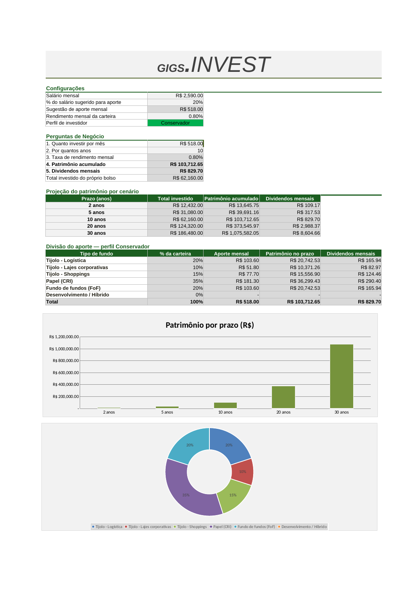
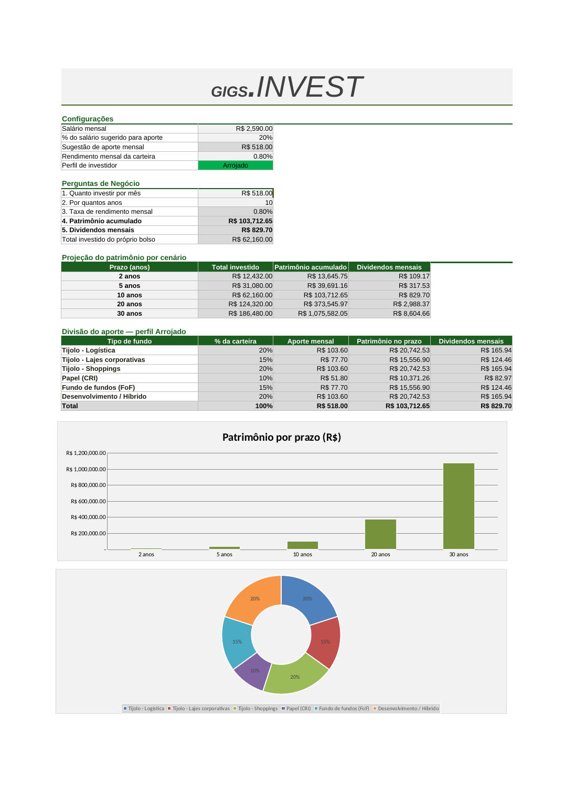

   # GIGS.INVEST – Simulador de Renda Passiva com FIIs
   
Planilha em Excel que simula quanto um aporte mensal em fundos imobiliários acumula e quanto rende em dividendos, com a divisão do aporte por perfil de investidor.

## Perguntas de negócio que a planilha responde

- Quanto investir por mês: Aporte (C14, entrada)
- Por quantos anos: Anos (C15, entrada)
- Qual a taxa de rendimento mensal: Taxa Mensal (C10, configuração)
- Quanto de patrimônio vai acumular: Patrimonio (C17)
- Quanto vai receber de dividendos por mês: C18

Também projeta o patrimônio em cenários de 2, 5, 10, 20 e 30 anos e divide o aporte entre seis tipos de fundo conforme o perfil escolhido numa lista (Conservador, Moderado ou Arrojado).

## Funcionamento

- `VF` calcula o patrimônio: `=VF(taxa_mensal; anos*12; -aporte)`. Os dividendos são `patrimônio × taxa_mensal`.
- `PROCV` com chave composta traz o percentual de cada tipo de fundo: `=PROCV(perfil&"|"&tipo; tabela_perfis; 4; FALSO)`. A chave (por exemplo, `Moderado|Papel (CRI)`) é montada na aba `Base`.
- Intervalos nomeados deixam as fórmulas legíveis: `salario`, `pct_aporte`, `sugestao_aporte`, `taxa_mensal`, `perfil`, `aporte`, `anos`, `patrimonio`, `lista_perfis`, `tabela_perfis`.
- Validação de dados na lista de perfis e nas entradas (prazo, aporte e taxa).
- Dois gráficos: colunas com o patrimônio por prazo e rosca com a divisão da carteira, que muda junto com o perfil escolhido.

## Exemplo de simulação

Salário de R$ 2.590, sugestão de aporte de 20% do salário (R$ 518), 10 anos e rendimento de 0,80% ao mês:

- Total investido: R$ 62.160,00
- Patrimônio acumulado: R$ 103.712,65
- Dividendos mensais: R$ 829,70

O patrimônio e os dividendos são os mesmos em qualquer perfil. O que muda é a divisão do aporte entre os tipos de fundo.

## Percentuais por perfil

Os percentuais são premissas ilustrativas, sem fonte externa e sem caráter de recomendação. 

- Tijolo – Logística: 20% / 25% / 20%
- Tijolo – Lajes corporativas: 10% / 15% / 15%
- Tijolo – Shoppings: 15% / 20% / 20%
- Papel (CRI): 35% / 20% / 10%
- Fundo de fundos (FoF): 20% / 15% / 15%
- Desenvolvimento / Híbrido: 0% / 5% / 20%

## Limitações

Assume rendimento constante e reinvestimento dos dividendos, sem impostos, taxas ou variação de cotas. Salário, aporte e taxa são valores de exemplo.

## Arquivo

`Planejamento_FII.xlsx` (abas `Simulador` e `Base`).

## Evidência

Mesma simulação em dois perfis. O patrimônio e os dividendos não mudam, e a divisão do aporte e o gráfico de rosca se ajustam ao perfil. No Conservador, o Papel (CRI) recebe R$ 181,30 por mês e o Desenvolvimento / Híbrido recebe 0%. No Arrojado, o Papel (CRI) recebe R$ 51,80 e o Desenvolvimento / Híbrido recebe R$ 103,60.

### Perfil Conservador

### Perfil Arrojado

